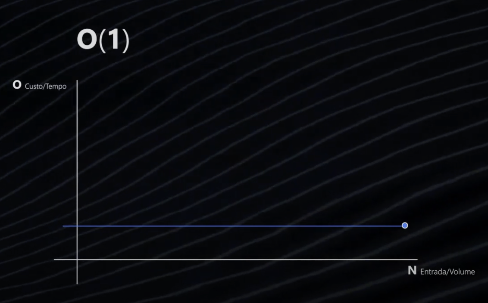
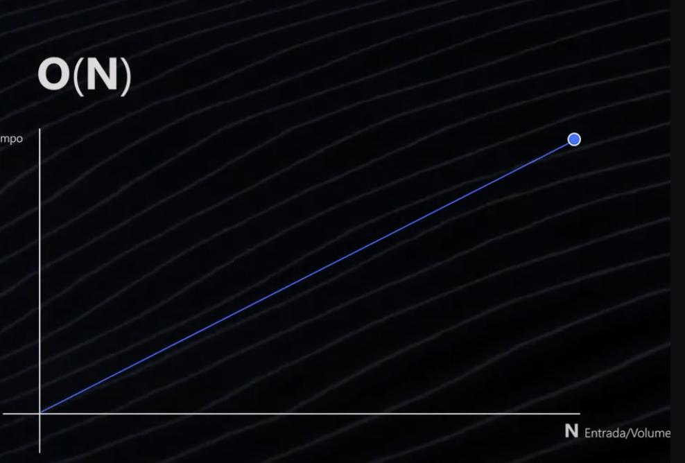
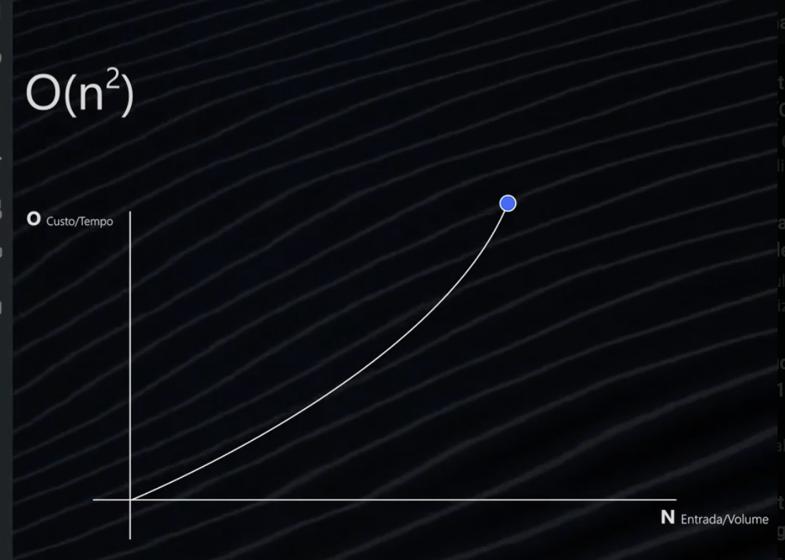

### O(1) → Constante

Independente do tamanho da entrada, o tempo de execução é constante.



```js
function myNumber(number) {
  console.log(`My numer ${number}`);
}
function firstElement(arr) {
  return arr[0]; // sempre executa uma unica operacao
}

// independente da entrada
console.log(myNumber(12));
console.log(firstElement([10, 20, 30])); // 10
```

### O(n) → Linear


- O tempo de execução cresce proporcionalmente (linearmente) ao tamanho da entrada;
- Quanto maior a entrada, maior o tempo de execucao.

```js
function sumArray(arr) {
  let sum = 0;
  for (let num of arr) sum += num;
  return sum;
}

function calc(entry) {
  for (i = 0; i < entry; i++) {
    console.log(`-> ${i}`);
  }
}

function myNumber(value) {
  // Aqui temos O(2 + n), mas como ignoramos as constantes, temos O(n)
  // Essa é uma otimização do exemplo da quadrática

  let linha = "";
  for (let i = 1; i <= value; i++) {
    linha = linha + " " + value;
  }
  for (let i = 1; i <= value; i++) {
    console.log(`${linha}`);
  }
}

console.log(sumArray([1, 2, 3, 4])); // 10
console.log(calc(1000));
```

### O(n²) – Quadrática

- Pra cada execucacao de um laco pai, eu tenho a execucacao de um laco inteiro (n x n)
- O tempo de execução cresce quadraticamente, como em um Bubble Sort.;
- se a entrada for 4, por exemplo, entao o numero de execucoes seriam 16



```js
function myNumber(value) {
  for (let i = 1; i <= value; i++) {
    let linha = "";

    for (let j = 1; j <= value; j++) {
      linha = linha + " " + value;
    }

    console.log(`${linha}`);
  }
}

function bubbleSort(arr) {
  for (let i = 0; i < arr.length; i++) {
    for (let j = 0; j < arr.length - i - 1; j++) {
      if (arr[j] > arr[j + 1]) [arr[j], arr[j + 1]] = [arr[j + 1], arr[j]];
    }
  }
  return arr;
}

console.log(bubbleSort([5, 2, 4, 1, 3])); // [1, 2, 3, 4, 5]
```

### O(log n) → Logarítmica

- O tempo de execução cresce logaritmicamente, como na busca binária;
- Conforme aumentamos a quantidade de dados de entrada, o tempo de execução não cresce na mesma proporção, mas sim muito mais devagar.

```js
function buscaBinaria(arr, target) {
  let left = 0,
    right = arr.length - 1;
  while (left <= right) {
    let mid = Math.floor((left + right) / 2);
    if (arr[mid] === target) return mid;
    arr[mid] < target ? (left = mid + 1) : (right = mid - 1);
  }
  return -1;
}

console.log(binarySearch([1, 3, 5, 7, 9], 5)); // 2
```

> **O(n log n) – Linear Logarítmica**

- O tempo de execução cresce em função de n log n, como no Merge Sort e Quick Sort;

```js
function mergeSort(arr) {
  if (arr.length < 2) return arr;
  let mid = Math.floor(arr.length / 2);
  let left = mergeSort(arr.slice(0, mid));
  let right = mergeSort(arr.slice(mid));
  return merge(left, right);
}

function merge(left, right) {
  let result = [];
  while (left.length && right.length) {
    result.push(left[0] < right[0] ? left.shift() : right.shift());
  }
  return result.concat(left, right);
}

console.log(mergeSort([4, 2, 7, 1, 9])); // [1, 2, 4, 7, 9]
```

> **O(n³) – Cúbica**

- O tempo de execução cresce de forma cúbica, como em um algoritmo de multiplicação de matrizes;

```js
function multiplyMatrices(A, B) {
  let n = A.length;
  let result = Array.from({ length: n }, () => Array(n).fill(0));

  for (let i = 0; i < n; i++) {
    for (let j = 0; j < n; j++) {
      for (let k = 0; k < n; k++) {
        result[i][j] += A[i][k] * B[k][j];
      }
    }
  }
  return result;
}

console.log(
  multiplyMatrices(
    [
      [1, 2],
      [3, 4],
    ],
    [
      [5, 6],
      [7, 8],
    ]
  )
);
```
